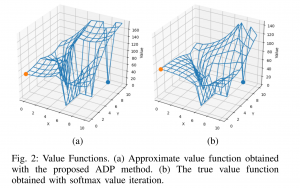
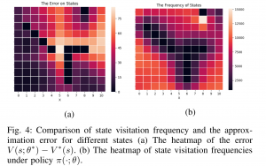
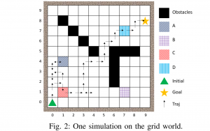

{:style="float: left;margin-left: 7px;margin-right: 7px;margin-top: 7px;margin-bottom: 7px" height="150"}

{:style="float: left;margin-left: 7px;margin-right: 7px;margin-top: 7px;margin-bottom: 7px" height="150"}

This objective is to develop a model-free reinforcement learning method for stochastic planning under temporal logic constraints. In recent work [1], we propose an approach to translate high-level system specifications expressed by a subclass of Probabilistic Computational Tree Logic (PCTL) into chance constraints. We devise a variant of Approximate Dynamic Programming method—approximate value iteration— to solve for the optimal policy while the satisfaction of the PCTL formula is guaranteed.

<iframe width="560" height="315" src="https://www.youtube.com/embed/MJRgdngLjbw" title="YouTube video player" frameborder="0" allow="accelerometer; autoplay; clipboard-write; encrypted-media; gyroscope; picture-in-picture" allowfullscreen></iframe>

{:style="float: right;margin-left: 7px;margin-right: 7px;margin-top: 7px;margin-bottom: 7px" height="150"}

{:style="float: right;margin-left: 7px;margin-right: 7px;margin-top: 7px;margin-bottom: 7px" height="150"}

In [2], we study model-free reinforcement learning to maximize the probability of satisfying high-level system specifications expressed in a subclass of temporal logic formulas—syntactically co- safe linear temporal logic. In order to address the issue of sparse reward given by satisfaction of temporal logic formula, we propose a topological approximate dynamic programming which includes two steps: First, we decompose the planning problem into a sequence of sub-problems based on the topological property of the task automaton which is translated from a temporal logic formula. Second, we extend a model-free approximate dynamic programming method to solve value functions, one for each state in the task automaton, in an order reverse to the causal dependency. Particularly, we show that the run-time of the proposed algorithm does not grow exponentially with the size of specifications. The correctness and efficiency of the algorithm are demonstrated using a robotic motion planning example.

### Related work:

1. 

2. 