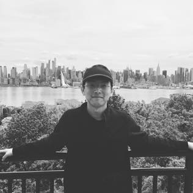

---

Newlayout: home
permalink: /
permalink_name: /home
title: Robot Makes World Better
---

# Lening Li (郦乐宁)

{:style="float: right;margin-left: 7px;margin-right: 7px;margin-top: 7px;"}

I am a Ph.D. candidate in Robotics Engineering department in Worcester Polytechnic Institute (WPI) under Prfessor [Jie Fu](https://users.wpi.edu/~jfu2/). I received a B.S. degree in Information Security (Computer Science) and a B.A. degree in English Language and Literature from Harbin Institute of Technology, China in 2014, and an M.S. degree in Computer Science from WPI, MA, USA, in 2016 under Professor [Michael A. Gennert](http://web.cs.wpi.edu/~michaelg/). To see a more formal biography, click [here](./assets/CV.pdf).

My research interests include reinforcement learning, stochastic control, game theory, motion planning, and formal methods.

## News

- I finished my duty as President of Graduate Student Government from Jan 2019 - May 2020.
- I attended **Robot Learning Workhop** 2019 in Lehigh University.
- I went to **NERC** 2019 in University of Pennsylvania.
- I presented on **American Control Conference** 2019.
- I attended **Princeton Day of Optimization** 2018.
- ~~I presented my work in **ICRA 2017** Singapore.~~
- ~~I presented a poster in the **Humanoids 2016** which is held in Cancun, Mexico.~~
- ~~I presented a poster in the **NERC V** that will be hold in Cornell University.~~

